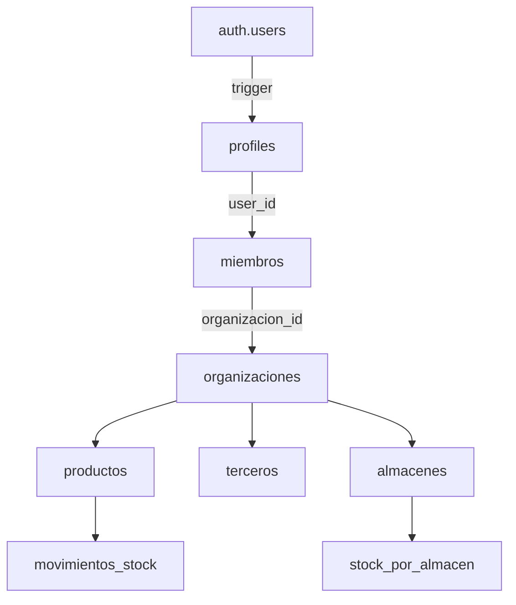

# ✨ Sistema de Stock SaaS - Supabase Auth Nativo

## 🎯 Arquitectura Final

```
Frontend: Next.js 14 + TypeScript + Supabase Auth
Backend: Supabase (PostgreSQL + RLS + Auth)
No ORM: @supabase/supabase-js + @supabase/ssr
```

## ✅ Lo Que Tienes Ahora

### 1. Schema SQL Nativo (`supabase/schema.sql`)
- ✅ Tabla `profiles` sincronizada con `auth.users`
- ✅ Trigger automático para crear perfiles
- ✅ 10 tablas de negocio con UUIDs
- ✅ Enums de TypeScript
- ✅ Soft deletes y timestamps automáticos
- ✅ Índices parciales para SKU reutilizable
- ✅ Columnas generadas (`valor_total`)

### 2. RLS Completo (`supabase_setup.sql`)
- ✅ 24+ políticas RLS
- ✅ Usa `auth.uid()` directamente
- ✅ Permisos por rol (ADMIN/VENDEDOR)
- ✅ 3 Vistas optimizadas
- ✅ 3 Funciones RPC
- ✅ Trigger para actualizar stock automáticamente

### 3. TypeScript Types (`lib/database.types.ts`)
- ✅ Tipos para todas las tablas
- ✅ Tipos Row/Insert/Update
- ✅ Tipos para vistas
- ✅ Tipos para funciones RPC

### 4. Cliente Supabase (`lib/supabase.ts`)
- ✅ Cliente para navegador con SSR
- ✅ Cliente para servidor con cookies
- ✅ Cliente admin (bypass RLS)

### 5. Helpers RLS (`lib/supabase-rls.ts`)
- ✅ `getCurrentUser()`
- ✅ `getUserOrganizations()`
- ✅ `isOrganizationAdmin()`
- ✅ `getUserRole()`
- ✅ `hasOrganizationAccess()`

### 6. Ejemplos de Código
- ✅ API Routes con Supabase Auth
- ✅ Login/Signup components
- ✅ Queries con RLS automático

## 🚀 Cómo Funciona

### Autenticación

```typescript
// 1. Usuario se registra
const { data } = await supabase.auth.signUp({
  email: 'user@example.com',
  password: 'password',
  options: {
    data: { full_name: 'Juan Pérez' }
  }
})

// 2. Trigger crea perfil automáticamente en public.profiles
// 3. Usuario puede hacer login y ver sus organizaciones
```

### Row Level Security

```sql
-- Política automática:
CREATE POLICY "Ver productos de mis organizaciones" ON productos
  FOR SELECT USING (
    organizacion_id IN (
      SELECT organizacion_id 
      FROM miembros 
      WHERE user_id = auth.uid() -- ← Automático con Supabase Auth
    )
  );
```

### Queries Seguras

```typescript
// En cualquier parte de tu app:
const { data } = await supabase
  .from('productos')
  .select('*')
// ↑ RLS filtra automáticamente por usuario
// Solo verás productos de TUS organizaciones
```

## 📊 Entidades Principales



## 🔐 Niveles de Seguridad

1. **Supabase Auth**: Maneja sesiones y JWT
2. **RLS Policies**: Filtra datos a nivel de DB
3. **Funciones RPC**: Valida permisos (is_organization_admin)
4. **Triggers**: Mantiene integridad (stock, perfiles)

## 📦 Dependencias Mínimas

```json
{
  "dependencies": {
    "@supabase/supabase-js": "^2.39.0",
    "@supabase/ssr": "^0.0.10",
    "next": "^14.1.0"
  }
}
```

## 🎨 Features Avanzados

### 1. Stock Automático
```typescript
// Crear movimiento
await supabase.from('movimientos_stock').insert({
  tipo: 'ENTRADA',
  cantidad: 10,
  producto_id,
  almacen_id,
  organizacion_id
})

// ↑ Trigger actualiza stock_por_almacen y productos.stock_actual
```

### 2. Snapshots Financieros
```typescript
// Los movimientos guardan precios del momento
{
  precio_unitario_snapshot: 1000,
  costo_unitario_snapshot: 500,
  valor_total: 10000 // ← Columna generada (automática)
}
```

### 3. Vistas Optimizadas
```typescript
// Una sola query para dashboard completo
const { data } = await supabase
  .from('view_movimientos_completo')
  .select('*')
// Incluye: producto, usuario, tercero, almacén, cálculos
```

## 🔄 Flujo de Usuario

1. **Registro**
   - Usuario se registra con Supabase Auth
   - Trigger crea perfil en `profiles`

2. **Crear Organización**
   - Usuario crea org (cualquiera puede)
   - Se auto-agrega como ADMIN en `miembros`

3. **Agregar Productos**
   - Solo si es miembro de la org
   - RLS valida automáticamente

4. **Movimientos**
   - Crear entrada/salida
   - Trigger actualiza stock automático
   - Snapshots guardan precios

## ⚡ Performance

- ✅ Índices en todas las FK
- ✅ Índices parciales (SKU único solo si no borrado)
- ✅ Índices GIN para búsqueda de texto
- ✅ Columnas generadas (no cálculos en runtime)
- ✅ Vistas con joins pre-calculados

## 🎯 Próximos Pasos

1. **Configura Supabase**
   - Crea proyecto
   - Ejecuta SQL files

2. **Instala deps**
   ```bash
   npm install @supabase/supabase-js @supabase/ssr
   ```

3. **Configura .env.local**
   ```env
   NEXT_PUBLIC_SUPABASE_URL=...
   NEXT_PUBLIC_SUPABASE_ANON_KEY=...
   ```

4. **Implementa UI**
   - Login/Signup
   - Dashboard
   - CRUD Productos

5. **Deploy**
   - Vercel + Supabase (automático)

## 🌟 Ventajas Clave

✅ **Sin ORM**: Menos dependencies, más control  
✅ **RLS Nativo**: Seguridad a nivel de DB  
✅ **Auth Integrado**: No necesitas NextAuth  
✅ **Realtime**: Suscripciones built-in  
✅ **Storage**: Para imágenes de productos  
✅ **Edge Functions**: Si necesitas lógica custom  

## 📚 Archivos Importantes

- `supabase/schema.sql` - Schema completo
- `supabase_setup.sql` - RLS + Vistas + Triggers
- `lib/database.types.ts` - Tipos TypeScript
- `lib/supabase.ts` - Cliente configurado
- `lib/supabase-rls.ts` - Helpers
- `SUPABASE_MIGRATION.md` - Guía paso a paso

---

**¡Listo para producción! 🚀**
